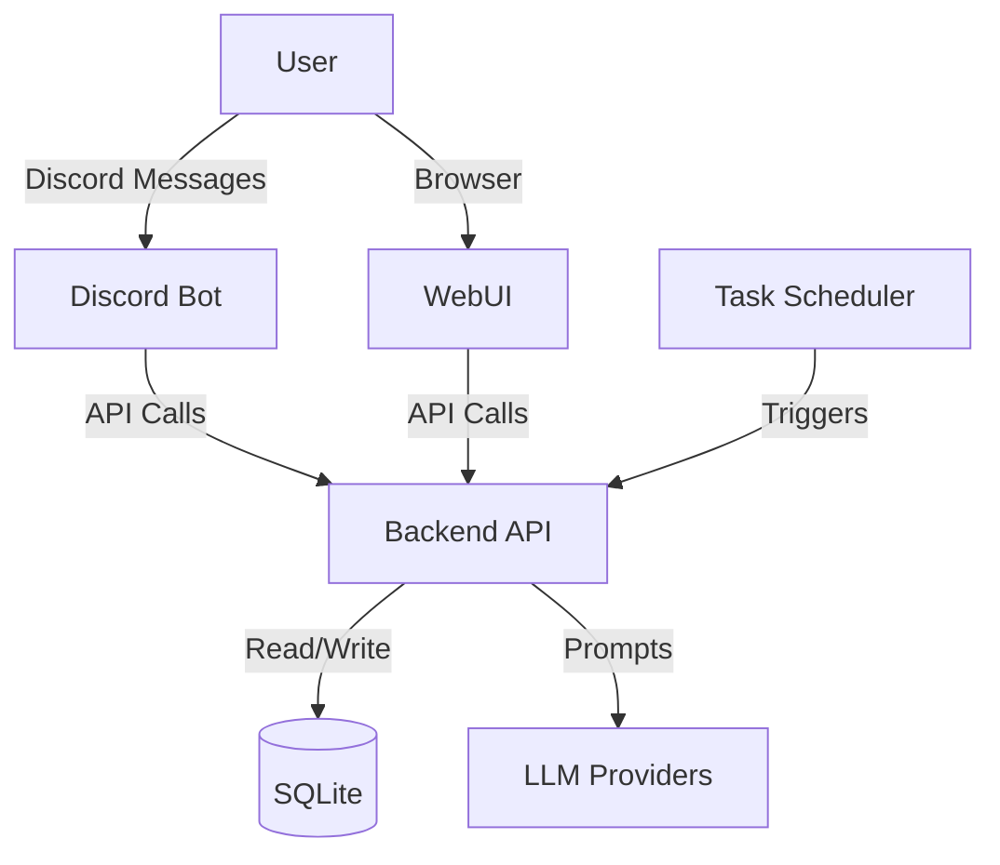

# 🧠 LifeOS Codebase Overview

This document provides a technical summary of the LifeOS codebase for developers and contributors who need to understand the system's architecture and inner workings without reading every file.

---

## 🏗️ System Architecture

LifeOS is a distributed system consisting of three primary services coordinated via Docker Compose:

1.  **Backend (FastAPI)**: The central intelligence and data hub.
2.  **Discord Bot (discord.py)**: The primary user interface for interaction and notifications.
3.  **WebUI (React)**: A secondary dashboard for management and configuration.

---

## 📂 Component Breakdown

### 1. Backend (`/backend`)
The backend is built with FastAPI and handles logic, data persistence, and agent orchestration.

*   **`app/models.py`**: Defines the SQLAlchemy ORM models (Database) and Pydantic schemas (API). Core tables include `agents`, `chat_sessions`, `life_items` (tasks/goals), and `prayer_windows`.
*   **`app/services/orchestrator.py`**: The "brain" of the system. It:
    *   Constructs system prompts for agents.
    *   Manages context retrieval from `memory.py`.
    *   Classifies risk levels for incoming requests.
    *   Applies approval policies (auto, medium, high).
*   **`app/services/provider_router.py`**: Routes LLM requests to OpenRouter, NVIDIA, Google, or OpenAI with fallback logic.
*   **`app/services/tools/`**: Extends agent capabilities with external tools like `web_search.py` (DuckDuckGo/SearXNG).
*   **`app/services/scheduler.py`**: Manages recurring agent nudges and health checks.

### 2. Discord Bot (`/discord-bot`)
A `discord.py` application that acts as the primary interaction surface.

*   **`bot/main.py`**: Entry point that loads "Cogs" (modular command groups).
*   **`bot/cogs/`**:
    *   `agents.py`: Handles `!ask`, `!sandbox`, and session management.
    *   `approvals.py`: Posts pending actions to the `#approval-queue` channel and handles emoji reactions.
    *   `reminders.py`: Listens for scheduled events from the backend to post in channels.

### 3. WebUI (`/webui`)
A Vite-powered React single-page application.

*   **`src/api.js`**: The central API client using `fetch` to communicate with the backend.
*   **`src/components/`**: Modular UI elements for the dashboard, agent list, and goal tracking.

---

## 🔄 Key Data Flows

### A. User Request (Discord)
1.  User types `!ask health-fitness "What should I eat?"` in Discord.
2.  **Bot** receives the command and sends a POST request to `/api/agents/chat`.
3.  **Orchestrator** retrieves recent chat history and builds a prompt.
4.  **Provider Router** calls the LLM (e.g., GPT-4 via OpenRouter).
5.  **Orchestrator** checks the response:
    *   If **Low Risk**: Returns response immediately to Discord.
    *   If **High Risk**: Creates a `PendingAction` and tells the user it's waiting for approval.
6.  **Bot** posts the action to `#approval-queue`.
7.  User reacts with ✅ in Discord.
8.  **Bot** calls `/api/approvals/decide`, and the action is executed/finalized.

### B. Scheduled Nudge
1.  **Scheduler** (in Backend) fires based on an agent's cadence (e.g., "Daily 9am").
2.  **Orchestrator** generates a "proactive" message from the agent.
3.  **Discord Notify** service sends the message directly to the mapped Discord channel.

---

## 🛠️ Performance & Design Patterns

*   **Async Everywhere**: Both Backend and Bot use asychronous programming (`asyncio`) for high concurrency.
*   **SkillOps**: New capabilities can be added by dropping a python file into `backend/app/services/tools/`.
*   **Risk-Based Approvals**: Significant actions (like modifying a recurring goal) are held in a queue until a human confirms, preventing LLM hallucinations from causing data loss.
