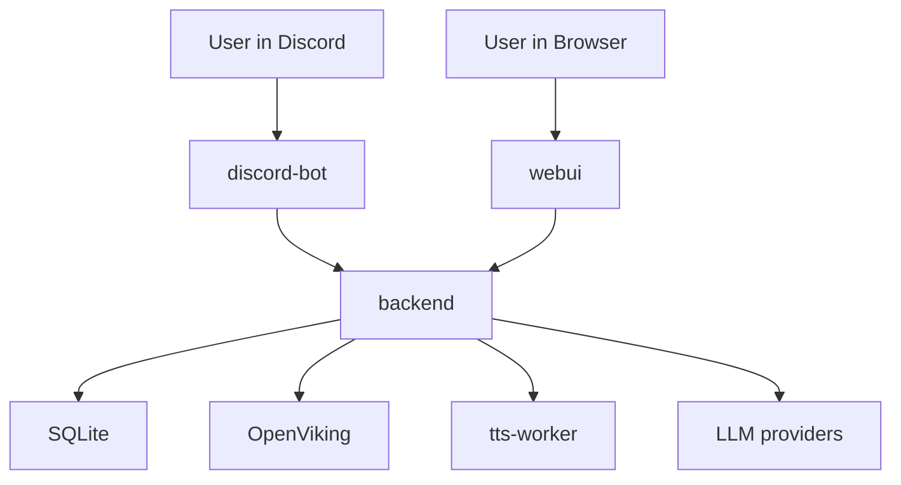

# LifeOS Codebase Overview

This document describes the current architecture of the repo as it exists today.

## System Architecture

LifeOS is a five-service Docker Compose system:

### Service Roles

| Service | Responsibility |
| --- | --- |
| `backend` | FastAPI API, orchestration, approvals, profile/settings, life items, intake inbox, daily scorecards, prayer/Quran data, jobs, SSE events, workspace integration |
| `discord-bot` | Command surface, approval reactions, prayer reminders, quick accountability logs, natural-language job and agent proposals, voice channel playback |
| `webui` | Operator dashboard for health, today accountability board, jobs, approvals, agents, providers, experiments, prayer, Quran, and profile/settings |
| `openviking` | Memory backend, repo/external resource indexing, workspace retrieval, legacy memory import target |
| `tts-worker` | Local synthesis service used by backend TTS APIs and Discord voice playback |

## Backend Boot Sequence

The backend startup flow in `backend/app/main.py` currently does all of this before serving requests:

1. Enforces a non-default `API_SECRET_KEY`.
2. Enforces the OpenViking cutover (`MEMORY_BACKEND=openviking` and `OPENVIKING_ENABLED=true`).
3. Initializes the database.
4. Seeds default agents.
5. Syncs the TTS registry.
6. Verifies OpenViking readiness.
7. Imports legacy SQLite chat memory into OpenViking if needed.
8. Optionally syncs workspace resources into OpenViking.
9. Starts APScheduler and bootstraps agent cadence jobs.

That means OpenViking is no longer optional in the current runtime design.

## Major Backend Areas

### API Routers

- `backend/app/routers/agents.py`: agent CRUD, chat, sessions, scheduled runs, agent proposals
- `backend/app/routers/approvals.py`: pending actions, decision endpoint, approval stats
- `backend/app/routers/events.py`: SSE auth and realtime event streaming for Mission Control
- `backend/app/routers/experiments.py`: shadow-router history and provider telemetry
- `backend/app/routers/health.py`: health and readiness
- `backend/app/routers/jobs.py`: persistent scheduled job CRUD, proposals, run logs
- `backend/app/routers/life.py`: life items, check-ins, intake inbox, daily logs, today agenda, goal progress
- `backend/app/routers/prayer.py`: prayer schedule, check-ins, weekly dashboard, Quran/tahajjud/adhkar tracking
- `backend/app/routers/profile.py`: profile settings
- `backend/app/routers/settings.py`: global runtime settings
- `backend/app/routers/tts.py`: TTS model list, preview, synthesize, health
- `backend/app/routers/voice.py`: voice session start, interrupt, stop
- `backend/app/routers/workspace.py`: workspace archives, restore, sync

### Core Services

- `backend/app/services/orchestrator.py`: agent chat orchestration
- `backend/app/services/provider_router.py`: primary provider, fallback provider, exhaustive sweep, retries, telemetry, and shadow test trigger
- `backend/app/services/shadow_router.py`: non-blocking shadow calls for provider comparison
- `backend/app/services/telemetry.py`: in-memory provider performance and circuit-breaker state
- `backend/app/services/scheduler.py`: APScheduler wiring for agent cadence and persistent jobs
- `backend/app/services/jobs.py`: job normalization, persistence, next-run calculation, run log publishing
- `backend/app/services/life.py`: life items, intake snapshot, daily scorecards, rescue-plan logic, today agenda, quick-log updates
- `backend/app/services/memory.py`: legacy memory handling and OpenViking migration hooks
- `backend/app/services/openviking_client.py`: OpenViking API wrapper
- `backend/app/services/workspace.py`: workspace path scoping, archive/restore, OpenViking sync, action parsing
- `backend/app/services/prayer_service.py` and `backend/app/services/quran_service.py`: prayer and Quran logic
- `backend/app/services/chat_sessions.py`: per-agent session creation, rename, clear, and message retrieval

## Current Frontend Structure

The WebUI is a Vite + React app in `webui/`.

Main entry points:

- `webui/src/App.jsx`: page shell and navigation
- `webui/src/api.js`: fetch client, token handling, and API wrappers
- `webui/src/hooks/useEventStream.js`: SSE client with buffering and reconnects
- `webui/src/components/MissionControl.jsx`: realtime operations dashboard
- `webui/src/components/TodayView.jsx`: accountability board with scorecard, next prayer, rescue plan, quick logs, and agenda blocks
- `webui/src/components/AgentConfig.jsx`: agent settings, voice preview, workspace sync/archive restore, chat sessions
- `webui/src/components/JobsManager.jsx`: job CRUD and run log viewing
- `webui/src/components/GlobalSettings.jsx`: `data_start_date`, autonomy, mutation approval
- `webui/src/components/ExperimentDashboard.jsx`: provider telemetry and shadow test history

Token flow:

- The browser stores `API_SECRET_KEY` in local storage as `lifeos_token`.
- Standard API requests send it as `X-LifeOS-Token`.
- SSE cannot send custom headers, so the UI first exchanges the token for a short-lived HttpOnly cookie through `POST /api/events/auth`.

## Discord Bot Structure

The Discord bot lives in `discord-bot/`.

Main modules:

- `bot/main.py`: bot setup, command prefix, help topics, cog loading
- `bot/cogs/agents.py`: `!ask`, `!sandbox`, sessions, life item commands, `!daily`, `!weekly`
- `bot/cogs/reminders.py`: prayer/Quran/habit commands, quick accountability logs, reminder dispatch, workout and spouse note shortcuts
- `bot/cogs/automation.py`: `!schedule`, `!spawnagent`, `!reply`, job inspection commands
- `bot/cogs/approvals.py`: pending queue and owner-only approve/reject paths
- `bot/cogs/voice.py`: Discord voice join, speak, interrupt, leave
- `bot/nl.py`: lightweight parser for natural-language job and agent prompts

The bot is currently the fastest way to:

- talk to agents
- handle approvals
- create simple jobs from natural language
- log prayer, Quran, sleep, meals, hydration, training, and shutdown activity
- use voice playback

## Important Data Flows

### 1. Agent Chat With Session Memory

1. Discord or WebUI sends `/api/agents/chat`.
2. The backend resolves the active chat session.
3. The orchestrator builds context from recent session memory and OpenViking.
4. The provider router calls the primary provider, then fallback/sweep providers if needed.
5. Risk and approval logic decide whether the result is returned directly or queued as a pending action.
6. Session messages are persisted and available through session APIs.

### 2. Persistent Jobs

1. Jobs are stored in SQLite.
2. APScheduler mirrors those jobs in memory.
3. Each run writes a `JobRunLog`.
4. Job and run updates publish realtime events for Mission Control.
5. Jobs can be created directly through API/WebUI or proposed through Discord natural-language flows.

### 3. Workspace Retrieval And Safe Mutation

1. Agents can be granted workspace access with explicit path scopes.
2. The backend syncs those paths into OpenViking for retrieval.
3. File mutations are expressed as structured workspace actions.
4. Previous file versions are archived before mutations.
5. Delete operations require approval.
6. Archives can be restored from the WebUI.

### 4. Voice

1. Discord bot joins a voice channel and asks the backend to start a voice session.
2. The backend routes text through the TTS manager.
3. The TTS manager calls `tts-worker`.
4. The bot plays returned WAV audio in Discord and can interrupt playback.

### 5. Realtime UI Updates

1. WebUI exchanges the API token for an SSE cookie.
2. `GET /api/events` streams system, job, approval, prayer, and session updates.
3. Mission Control and related pages merge those updates into React Query caches.

### 6. Daily Accountability Loop

1. WebUI `Today` and Discord quick logs both write to `POST /api/life/daily-log`.
2. Backend resolves local date from profile timezone and loads or creates one `daily_scorecards` row for that day.
3. Deterministic rules update sleep, meals, hydration, training, family, shutdown, and priority counters without LLM involvement.
4. `GET /api/life/today` returns legacy agenda fields plus `scorecard`, `next_prayer`, and rule-based `rescue_plan`.
5. WebUI updates the board in place after quick logs, and Discord echoes back compact scorecard state.

## Storage Layout

| Path | What it stores |
| --- | --- |
| `storage/lifeos.db` | Main SQLite database, including life items, intake inbox, prayer/Quran data, jobs, and `daily_scorecards` |
| `storage/openviking/` | OpenViking runtime data and indexed resources |
| `storage/workspace-archive/` | Archived files created during workspace mutations |
| `skills/` | Mounted skills available to backend tooling |
| `.venv/.env` | Runtime environment file used by Compose and the backend/bot |

## Current Operational Constraints

- OpenViking must be healthy for the backend to start cleanly.
- Most API routes are protected with `X-LifeOS-Token`.
- The WebUI token storage model is suitable for trusted localhost use, not a public multi-user deployment.
- Provider telemetry is intentionally in-memory, so it resets on restart.
- `scripts/restore.sh` performs a real `git checkout`, so it should be treated as an operator recovery tool, not a casual convenience script.

## Good Entry Points For Contributors

- Product flow: `README.md`
- Bot commands: `docs/DISCORD_COMMANDS.md`
- Operations: `docs/LOCAL_PROD_RUNBOOK.md`
- Backend startup: `backend/app/main.py`
- Daily accountability logic: `backend/app/services/life.py`
- Agent/chat behavior: `backend/app/services/orchestrator.py`
- Jobs: `backend/app/routers/jobs.py` and `backend/app/services/jobs.py`
- Workspace logic: `backend/app/services/workspace.py`
- WebUI state flow: `webui/src/api.js`, `webui/src/hooks/useEventStream.js`, `webui/src/components/MissionControl.jsx`, and `webui/src/components/TodayView.jsx`
